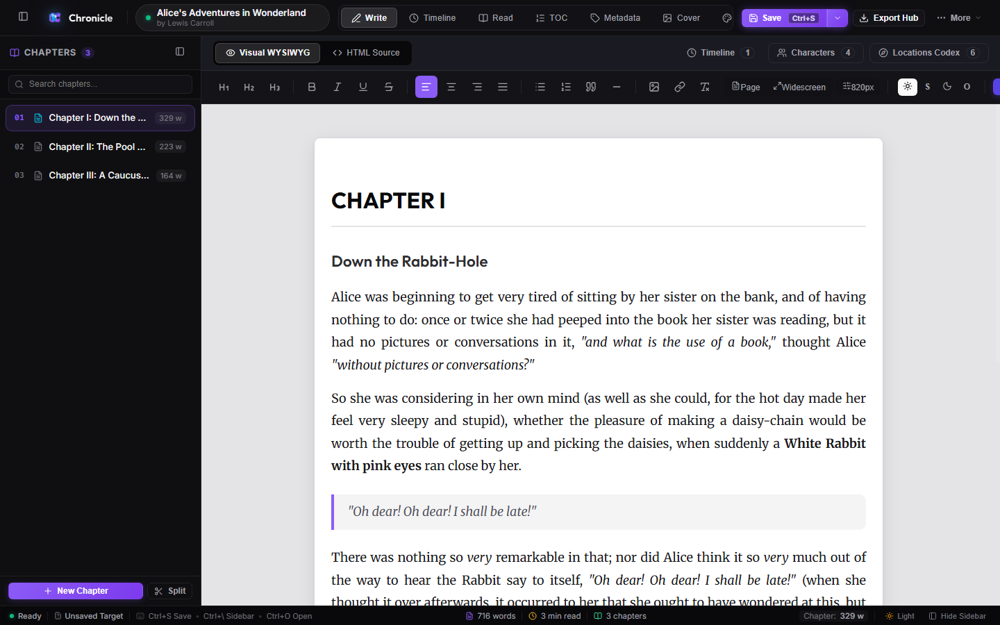
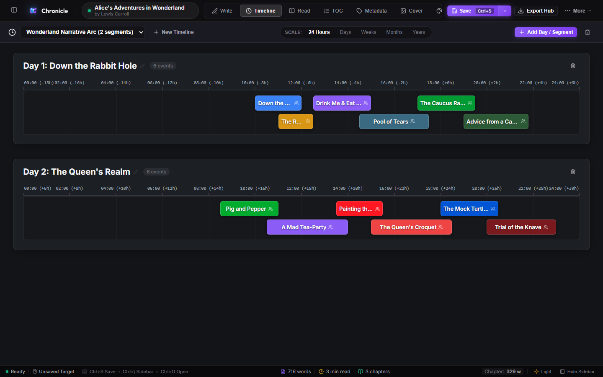
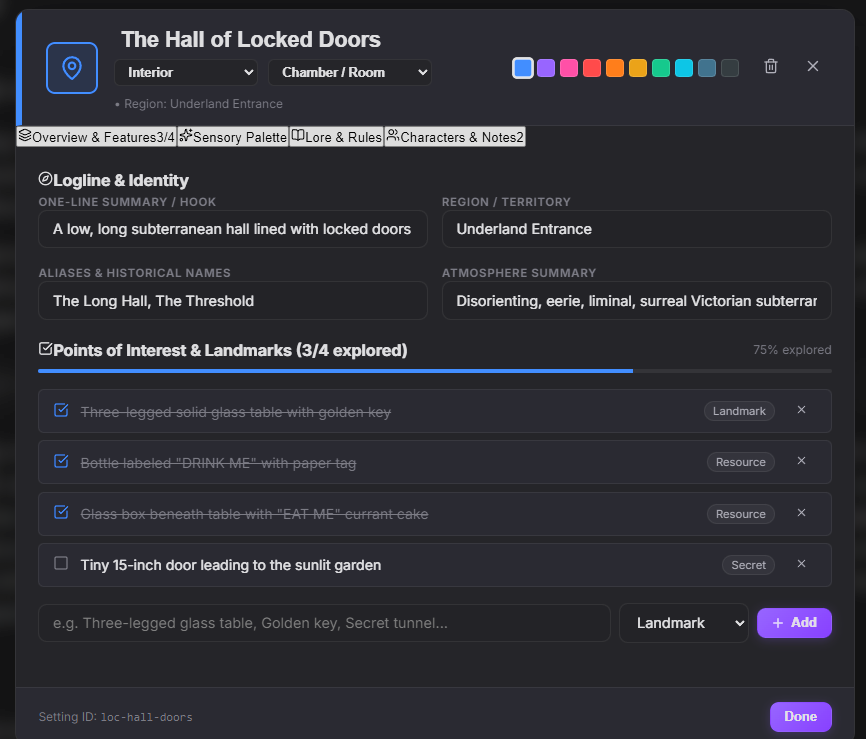

<div align="center">

  

  # Chronicle

  **The Premier All-in-One Authoring & Publishing Studio for Novelists**

  *Distraction-free writing, dual-view author comments, visual narrative timelines, worldbuilding codex, offline neural audio proofreading, book cover designer, and print-ready Vector PDF / EPUB 3 typesetter.*

  [](https://www.gnu.org/licenses/agpl-3.0)
  [](#cross-platform--downloads)
  [](https://www.typescriptlang.org/)
  [](https://tauri.app/)
  [](https://react.dev/)
  [](#100-local-first--private)

  <br />

  [**Launch Online Studio**](https://pazvanti.github.io/Chronicle/app/) •
  [**Website & Tour**](https://pazvanti.github.io/Chronicle/) •
  [**Download for Windows**](https://pazvanti.github.io/Chronicle/downloads/Chronicle.exe) •
  [**Download for macOS**](https://pazvanti.github.io/Chronicle/downloads/Chronicle.dmg)

</div>

<br />

<div align="center">
  
</div>

---

## 🌟 Why Chronicle?

Writing a novel shouldn't require juggling four separate paid subscriptions. **Chronicle** unifies the entire creative pipeline into one cohesive, distraction-free powerhouse:

* Replaces **Scrivener** with a fast, modern WYSIWYG chapter binder and dual-view author annotations.
* Replaces **Vellum** with publication-ready Vector PDF typesetting and standard EPUB 3 exports.
* Replaces **World Anvil** with an integrated, private Worldbuilding Codex for character psychology and sensory locations.
* Replaces **Plottr / Aeon Timeline** with visual, multi-strand narrative timelines that prevent plot-hole collisions.
* Replaces paid **TTS proofreaders** with private, on-device Kokoro AI neural voice audio.

### 🛡️ 100% Local-First & Private
* **Zero Telemetry**: Chronicle collects no metrics, no trackers, and has no remote database.
* **No Cloud Lock-in**: Your work is saved in the open `.chronicle` format (a standard ZIP archive containing plain JSON and raw XHTML).
* **Optional Private Sync**: Sync directly to your own self-hosted WebDAV server (Nextcloud, ownCloud, Fastmail) with end-to-end credential storage.

---

## 🚀 Key Features

### ✍️ Distraction-Free Chapter Authoring
* **Modern WYSIWYG Canvas**: Pure, zero-jitter writing experience with customizable typography, margins, and line spacing.
* **Chapter Binder & Splitter**: Reorder chapters with drag-and-drop or split large scenes at cursor position in one click.
* **Live Word Count & Goals**: Track chapter lengths, overall manuscript progress, and daily word targets.

### 💬 Dual-View Author Comments
* **Side-by-Side & Inline Highlighting**: Select any passage to attach notes, plot questions, or revision reminders using a 6-color palette.
* **Zero-Leakage Export Guarantee**: All comments and annotations are automatically stripped upon publishing, guaranteeing clean, professional files.

### ⏳ Interactive Narrative Timeline Studio
* **Multi-Strand Plotting**: Track main plots, subplots, and character arcs simultaneously.
* **Flexible Timescales**: Zoom from granular hours and days to months and years.
* **Visual Collision Lanes**: Prevent continuity errors and impossible character overlaps before you finish your draft.

<div align="center">
  
</div>

### 📖 Deep Worldbuilding Codex
* **Character Dossiers**: Document archetypes, character arcs, physical appearances, psychological traits, and backstory secrets.
* **Sensory Location Dossiers**: Capture sight, sound, smell, weather, history, hazards, and connected characters for every setting.

<div align="center">
  
</div>

### 🎨 Built-In Book Cover Designer
* Craft typography-rich, custom book covers without leaving the app.
* Configure titles, subtitles, author credits, backgrounds, gradients, borders, and decorative emblems with high-resolution export.

### 🎙️ Offline Kokoro AI Neural Voices
* Listen to your chapters read aloud by state-of-the-art Kokoro AI neural voice models running directly on your computer via WebGPU / WASM.
* Catch clunky phrasing, dialogue hitches, and typos without sending a single byte of your story to external servers.

### 🖨️ Publication-Grade Exporters
* **Print Vector PDF**: Automated book formatting with mirror margins, running headers, drop caps, Roman numeral front matter, and proper chapter page breaks.
* **Standard EPUB 3**: Valid, reflowable EPUB files verified for Amazon Kobo, Kindle, and Apple Books.
* **Shunn Manuscript Format (DOCX)**: Formats your manuscript strictly according to the industry-standard William Shunn format for literary agent and editor submissions.
* **Chronicle Project (`.chronicle`)**: Comprehensive project backup preserving all drafts, codex dossiers, timelines, covers, and author comments in an open ZIP package.

---

## 💻 Cross-Platform & Downloads

Chronicle is available as both a native standalone desktop app and an in-browser web app:

| Platform | Format | Description | Download / Launch |
| :--- | :--- | :--- | :--- |
| **In-Browser** | Web Studio | Runs client-side in Chrome, Edge, Safari, Firefox | [**Launch Online**](https://pazvanti.github.io/Chronicle/app/) |
| **Windows** | Portable `.exe` | Standalone executable — **no installer required** | [**Download for Windows**](https://pazvanti.github.io/Chronicle/downloads/Chronicle.exe) |
| **macOS** | Disk Image `.dmg` | Drag-and-drop standalone image (Apple Silicon & Intel) | [**Download for macOS**](https://pazvanti.github.io/Chronicle/downloads/Chronicle.dmg) |

> [!TIP]
> The desktop application does not need an installer or administrative rights. Simply download `Chronicle.exe` or `Chronicle.dmg`, open it, and start writing immediately.

---

## 🛠️ Development & Building

### Prerequisites
* [Node.js](https://nodejs.org/) (v18.0.0 or later)
* [npm](https://www.npmjs.com/) (v9 or later)
* [Rust toolchain](https://rustup.rs/) (required only if building the native Tauri desktop app)

### 1. Clone & Install Dependencies
```bash
git clone https://github.com/pazvanti/Chronicle.git
cd Chronicle
npm install
```

### 2. Development Mode
Run the in-browser development server with Hot Module Replacement (HMR):
```bash
npm run dev
```

Run the native desktop application in development mode:
```bash
npm run tauri:dev
```

### 3. Production Builds
Build the production web application into `dist/`:
```bash
npm run build
```

Compile the standalone native desktop application (outputs to `src-tauri/target/release/`):
```bash
npm run tauri:build
```

Compile the complete GitHub Pages suite (presentation site + online web app + desktop download binaries):
```bash
npm run build:docs:all
```

---

## 📂 Project Architecture

```
Chronicle/
├── docs/                     # GitHub Pages presentation site & live Web Studio
│   ├── app/                  # Compiled in-browser Chronicle Web Studio
│   ├── assets/               # High-res showcase screenshots & brand assets
│   ├── downloads/            # Staged standalone desktop binaries (Chronicle.exe)
│   ├── index.html            # Showcase landing page
│   ├── main.js               # Dynamic OS detector & interactive showcase logic
│   └── style.css             # Landing page modern design system
├── public/                   # Static web assets & icons
├── scripts/                  # Build & publishing automation
│   ├── build-docs.js         # Builds in-browser studio into docs/app/
│   ├── build-docs-all.js     # Full suite compiler (web app + desktop binaries)
│   └── build-tauri.js        # Tauri desktop builder (standalone executable staging)
├── src/                      # React + TypeScript core studio application
│   ├── components/
│   │   ├── Characters/       # Worldbuilding character dossiers & archetypes
│   │   ├── Comments/         # Dual-view author comments & highlight manager
│   │   ├── Cover/            # Graphic book cover studio
│   │   ├── Editor/           # Distraction-free chapter binder & WYSIWYG editor
│   │   ├── Export/           # PDF, EPUB 3, and Shunn manuscript exporters
│   │   ├── Locations/        # Worldbuilding location dossiers & atmosphere
│   │   ├── Reader/           # Reader simulation view
│   │   ├── Timeline/         # Narrative timeline studio & collision plotter
│   │   └── TTS/              # Kokoro AI neural audio proofreader
│   ├── services/             # Pure business logic (parsers, exporters, WebDAV)
│   └── themes/               # Signature ModernX and Luminous Glass themes
├── src-tauri/                # Tauri 2 (Rust) native desktop wrapper
│   ├── src/                  # Native Rust application entrypoints
│   ├── Cargo.toml            # Rust dependency definitions
│   └── tauri.conf.json       # Desktop application window & security configurations
└── package.json              # Project scripts & npm dependencies
```

---

## 📄 Open File Format (`.chronicle`)

Chronicle believes your stories belong to you forever. A `.chronicle` file is an unencrypted standard ZIP archive that can be opened by any archive utility (7-Zip, PeaZip, Archive Utility):

```
my-novel.chronicle (ZIP)
├── project.json              # Manuscript title, author, and version metadata
├── metadata.json             # EPUB 3 publishing metadata & Dublin Core fields
├── toc.json                  # Table of contents hierarchy
├── manifest.json             # Asset & media item manifest
├── spine.json                # Linear reading order
├── chapters/                 # Individual chapter files in structured JSON
├── writer/                   # Worldbuilding codex, timelines, characters, comments
└── assets/                   # Book cover, character portraits, and inline images
```

---

## 📜 License

Chronicle is proudly free, open-source software licensed under the **GNU Affero General Public License v3 (AGPLv3)**.

You are free to use, modify, and redistribute this software in accordance with the terms of the GNU AGPLv3. See the [LICENSE](LICENSE) file for the full license text.

*Note: You retain 100% intellectual property ownership and commercial rights over every book, manuscript, and story you produce using Chronicle.*

---

<div align="center">
  <sub>Crafted with passion for novelists, storytellers, and authors everywhere.</sub>
</div>
